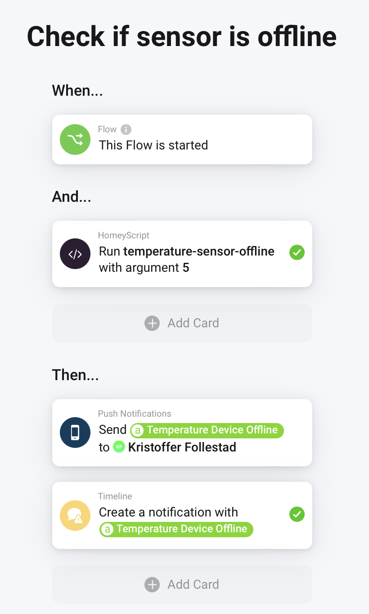

# HomeyScripts

A small collection of HomeyScripts for Homey Smart Home.

### temperature-sensor-offline.js
A script to check if any temperature or thermostat sensor is offline.
Will check for a temperature capability, and if the temperature hasn't been
updated for more than the given arguments in hours, or default 8 hours, it
will return a `true` value - `false` if everything is ok.

If `true`, there should be a logic/variable available named `Temperature Device Offline`. 
Which contain the names of the devices that are offline. Use this logic/variable
to send yourself a push notification.

Copy and modify the script to your need. Check the comments in the script.

Here's an example of a flow that uses this script.

